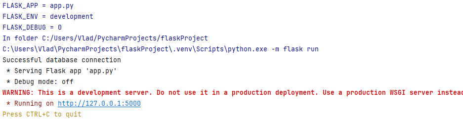
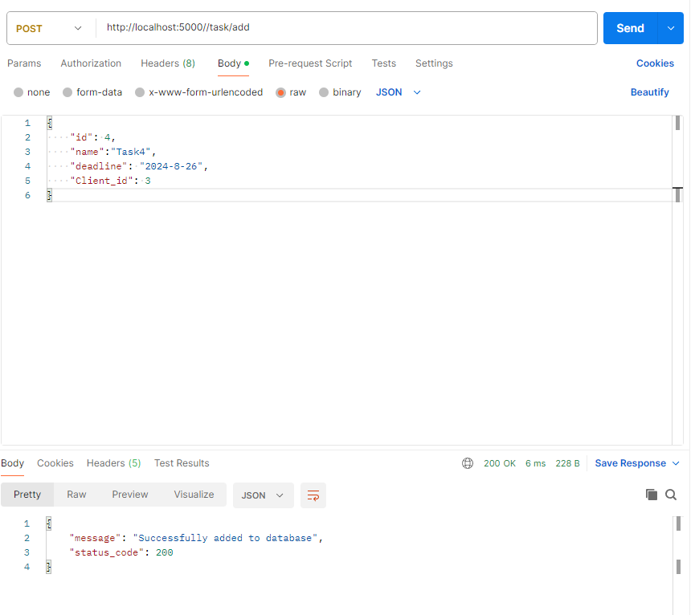
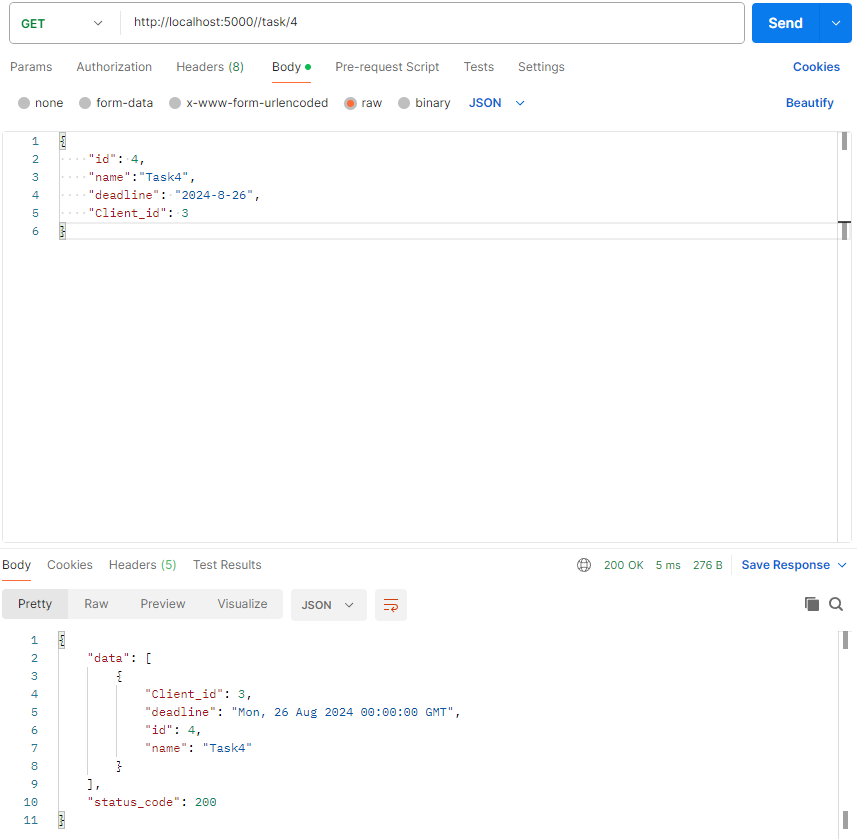
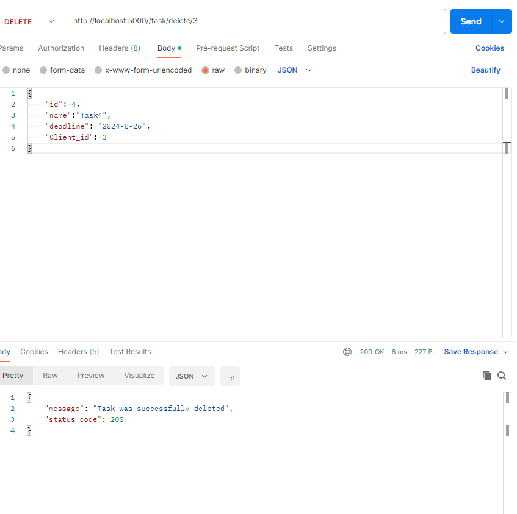
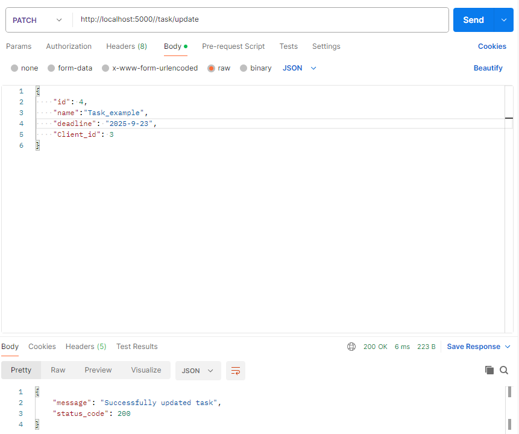

# Тестування працездатності системи

*В цьому розділі необхідно вказати засоби тестування, навести вихідні коди тестів та результати тестування.*

## Запуск серевера

## Метод GET ALL

## Метод ADD

## Метод GET ONE

## Метод DELETE

## Метод UPDATE

## Перевірка

